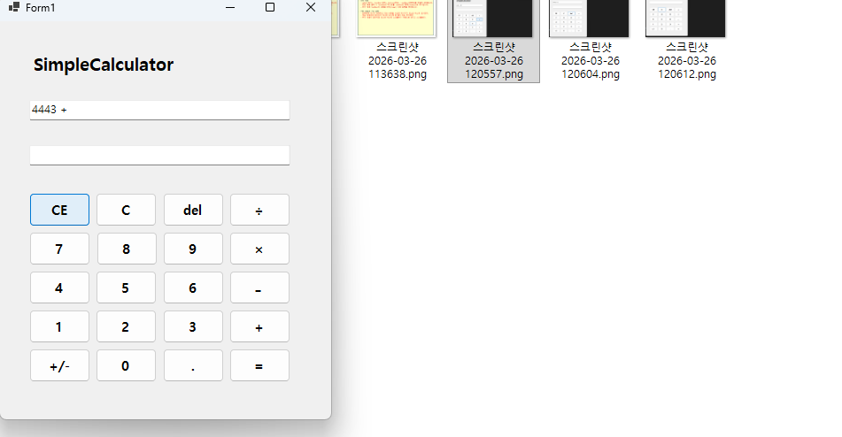
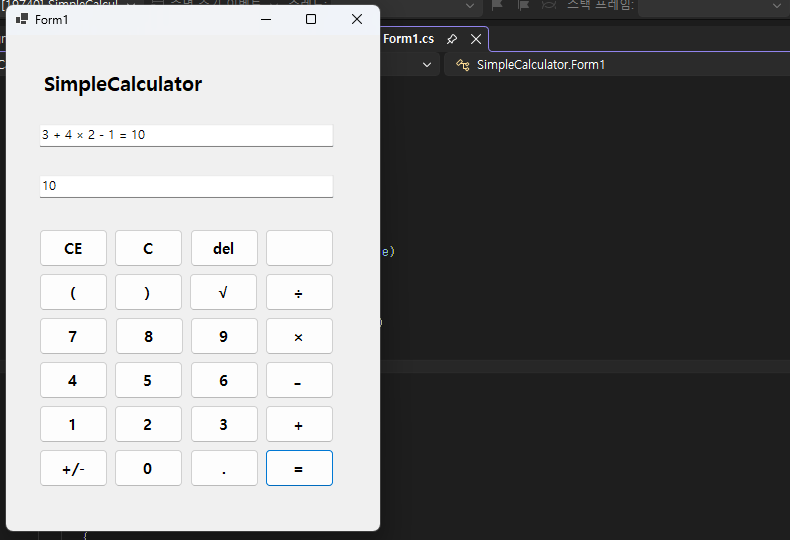
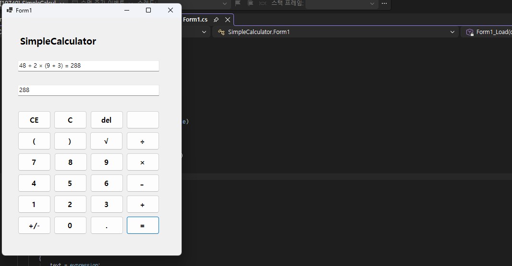

# (C# 코딩) SimpleCalculator

## 개요

- C# 프로그래밍 학습  
- 1줄 소개: 사용자의 입력을 받아 다양한 기능을 수행하는 계산기 및 메시지 처리 프로그램  

- 사용한 플랫폼  
  - C#, .NET Windows Forms, Visual Studio, GitHub  

- 사용한 컨트롤  
  - Label, TextBox, ListBox, Button  

- 사용한 기술과 구현 기능  
  - Visual Studio를 활용하여 Windows Forms 기반의 UI를 설계하고 각 컨트롤을 적절하게 배치하였다.  
  - string 클래스를 활용하여 사용자 입력 데이터를 처리하고, TextBox에 입력된 값을 ListBox에 출력하는 구조를 구현하였다.  
  - 이벤트 기반 프로그래밍 방식을 활용하여 버튼 클릭 시 동작이 수행되도록 구현하였다.  
  - 반복적인 입력과 출력이 가능하도록 상태 관리를 적용하여 프로그램의 안정성을 확보하였다.  
  - 계산기 기능 확장을 통해 사칙연산뿐만 아니라 괄호를 이용한 연산 우선순위 처리와 루트(√) 계산 기능을 구현하였다.  
  - ExpressionEvaluator 클래스를 직접 구현하여 수식을 파싱하고 계산하도록 구성하여 프로그램의 확장성과 정확성을 향상시켰다.  
  - CE, DEL, C 기능을 구현하여 사용자 입력을 효율적으로 수정할 수 있도록 하였으며, 결과를 "식 = 결과" 형태로 출력하여 가독성을 높였다.  

---

## 실행 화면 (과제1)

- 과제1 코드의 실행 스크린샷  

  

  
  

### 과제 내용
- Label(표시), TextBox(입력), Button(전송), ListBox(대화창)을 적절히 배치합니다.  
- 전송 버튼 클릭 시 TextBox의 텍스트를 ListBox의 항목(Items)으로 추가합니다.  
- 추가 직후 TextBox의 내용을 비워(Clear) 다음 입력을 준비합니다.  

### 구현 내용과 기능 설명
- 입력창에 메시지를 입력한 후 전송 버튼을 클릭하면 해당 문자열이 ListBox에 한 줄씩 추가되도록 구현하였다. 이 과정에서 사용자의 입력 데이터를 string 형태로 받아 처리하였으며, 버튼 이벤트를 활용하여 입력과 출력이 연결되도록 구성하였다. 또한 입력 완료 후 TextBox를 초기화하여 연속 입력이 자연스럽게 이어지도록 하였고, 메시지가 누적될수록 ListBox에 스크롤 기능이 자동으로 적용되도록 설정하여 사용자 편의성을 고려하였다. 이를 통해 기본적인 입력-출력 구조와 이벤트 기반 프로그래밍의 흐름을 이해할 수 있었다.  

---

## 실행 화면 (과제2)

- 과제2 코드의 실행 스크린샷  

  

  

### 과제 내용
- Label(표시), TextBox(입력), Button(전송), ListBox(대화창)을 적절히 배치합니다.  
- 전송 버튼 클릭 시 TextBox의 텍스트를 ListBox의 항목(Items)으로 추가합니다.  
- 추가 직후 TextBox의 내용을 비워(Clear) 다음 입력을 준비합니다.  

### 구현 내용과 기능 설명
- 과제2에서는 기존 입력 기능을 유지하면서 반복적인 데이터 처리를 중심으로 프로그램을 확장하였다. 사용자가 입력한 문자열이 누적되며 ListBox에 계속 추가되도록 구성하여 데이터 흐름을 확인할 수 있도록 하였다. 특히 이벤트가 반복적으로 호출되는 구조를 이해하는 데 중점을 두었으며, 입력과 출력이 지속적으로 연결되는 구조를 구현하였다. 또한 ListBox의 항목이 많아질 경우 자동으로 스크롤이 생성되도록 설정하여 많은 데이터를 처리할 때도 사용성이 유지되도록 하였다. 이를 통해 GUI 기반 프로그램의 동작 흐름을 보다 깊이 이해할 수 있었다.  

---

## 실행 화면 (과제3)

- 과제3 코드의 실행 스크린샷  

  

  
  
  
  

### 과제 내용
- Label(표시), TextBox(입력), Button(전송), ListBox(대화창)을 적절히 배치합니다.  
- 전송 버튼 클릭 시 TextBox의 텍스트를 ListBox의 항목(Items)으로 추가합니다.  
- 추가 직후 TextBox의 내용을 비워(Clear) 다음 입력을 준비합니다.  

### 구현 내용과 기능 설명
- 과제3에서는 사용자 편의성을 향상시키는 기능 구현에 중점을 두었다. 기존 메시지 입력 및 출력 기능에 더해, 입력 데이터를 보다 효율적으로 관리할 수 있도록 프로그램 구조를 개선하였다. 반복 입력 상황에서도 안정적으로 동작하도록 조건문과 상태 관리를 추가하였으며, UI 구성 요소 간의 연결을 명확하게 하였다. 또한 사용자 입력 이후 즉시 반응하도록 이벤트 처리를 정리하여 프로그램의 응답성을 높였다. 이를 통해 단순 기능 구현을 넘어 사용자 경험을 고려한 UI 설계와 이벤트 처리 방식에 대한 이해를 높일 수 있었다.  

---

## 실행 화면 (과제4)

- 과제4 코드의 실행 스크린샷  

  

  
  

### 과제 내용
- Label(표시), TextBox(입력), Button(전송), ListBox(대화창)을 적절히 배치합니다.  
- 전송 버튼 클릭 시 TextBox의 텍스트를 ListBox의 항목(Items)으로 추가합니다.  
- 추가 직후 TextBox의 내용을 비워(Clear) 다음 입력을 준비합니다.  

### 구현 내용과 기능 설명
- 과제4에서는 기존 기능을 확장하여 계산기 프로그램을 구현하였다. 사칙연산뿐만 아니라 괄호를 이용한 연산 우선순위 처리와 루트(√) 연산 기능을 추가하여 공학용 계산기와 유사한 동작이 가능하도록 설계하였다. 특히 기존 DataTable 방식의 한계를 보완하기 위해 ExpressionEvaluator 클래스를 직접 구현하여 수식을 파싱하고 계산하도록 하였으며, 이를 통해 괄호, 사칙연산, 루트 연산을 모두 처리할 수 있도록 개선하였다. 또한 계산 결과를 "식 = 결과" 형태로 출력하여 가독성을 높였고, CE 기능을 마지막 숫자만 삭제하도록 구현하여 실제 계산기와 유사한 사용자 경험을 제공하였다. 이를 통해 프로그램의 확장성과 완성도를 크게 향상시켰다.